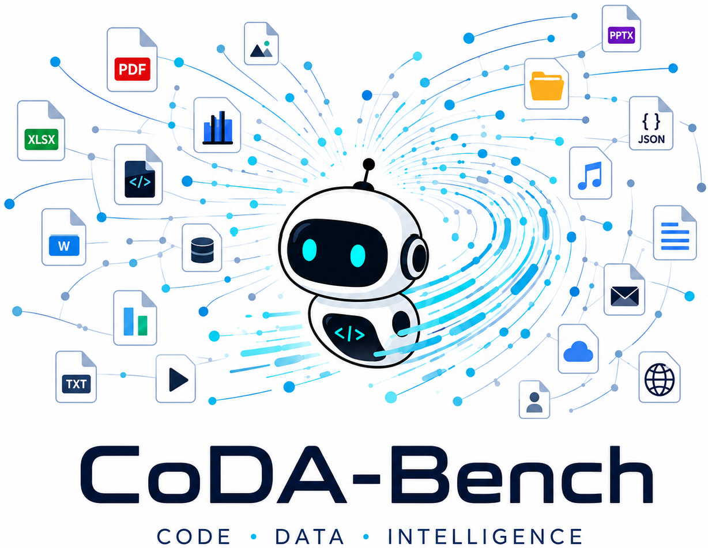
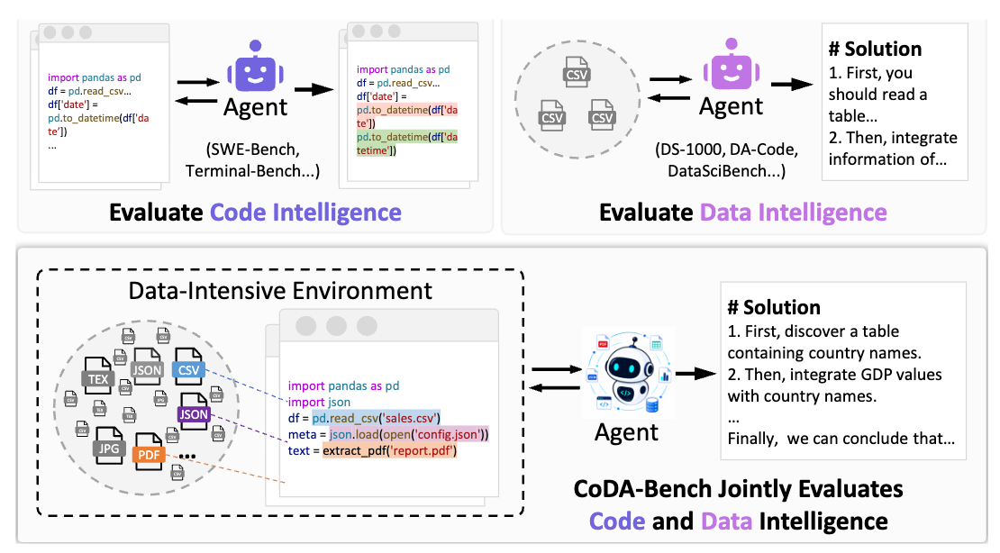

<p align="center">
  <a href="https://coda-bench.github.io/">
    
  </a>
</p>

[](#)
[](https://coda-bench.github.io/)
[](https://huggingface.co/datasets/RUC-DataLab/CoDA-Bench)
[](https://www.python.org/)
[](https://github.com/ruc-datalab/CoDA-Bench/blob/main/LICENSE)

---

Code and data for [ICML 2026] **CoDA-Bench: Can Code Agents Handle Data-Intensive Tasks?**

> **Authors**: **[Yuxin Zhang](https://yuxinzhang-research.github.io/), [Ju Fan](http://iir.ruc.edu.cn/~fanj/), [Meihao Fan](https://fmh1art.github.io/), [Shaolei Zhang*](https://zhangshaolei1998.github.io/), [Xiaoyong Du](http://info.ruc.edu.cn/jsky/szdw/ajxjgcx/jsjkxyjsx1/js2/7374b0a3f58045fc9543703ccea2eb9c.htm)**
>
>Renmin University of China

## 👋 Overview

CoDA-Bench (Code and Data-intensive Benchmark) is a benchmark for evaluating AI agents on data-intensive analytical tasks.
Given a *natural language question* and access to a *Linux sandbox* containing hundreds of data files, an agent must discover relevant data, write code, and produce the correct answer.



Unlike existing benchmarks that provide oracle data directly, CoDA-Bench requires agents to:
- 🔍 Discover relevant data among hundreds of semantically similar files
- 🗂️ Navigate complex file hierarchies in a Linux sandbox
- 🔗 Integrate information from multiple heterogeneous data sources
- 💻 Generate correct code for data-driven analytical tasks

## 📰 News
* **[Jun. 8, 2026]**: CoDA-Bench v1.0 released with Docker evaluation!
* **[Jun. 1, 2026]**: CoDA-Bench paper accepted at ICML 2026!

## 📊 Dataset Statistics

| Metric | Value |
|--------|-------|
| **Total Tasks** | 1,009 (full) / 119 (hard subset) |
| **Communities** | 31 (full) / 15 (hard subset) |
| **Source Datasets** | 199 Kaggle datasets |
| **Avg Files per Task** | ~980 files |
| **Total Size** | ~43 GB (compressed) |

## 🚀 Quick Start

### Installation

```bash
git clone https://github.com/ruc-datalab/CoDA-Bench.git
cd CoDA-Bench
pip install -e .
```

### Download Dataset

```bash
# One-command setup: downloads and extracts everything
python scripts/setup_dataset.py --data-dir ./datasets
```

This downloads:
- Benchmark files (`coda_bench.json`, `coda_bench_hard.json`)
- Community data archives (31 communities, ~43 GB)
- Automatically extracts all archives

### Run Evaluation (Docker Mode)

**Step 1: Build Docker Image**
```bash
cd docker
./build_all.sh
cd ..
```

**Step 2: Set API Credentials**
```bash
export LLM_API_KEY="your-api-key"
export LLM_BASE_URL="https://api.openai.com/v1"  # Optional
```

**Step 3: Run Evaluation**
```bash
# Quick test (4 instances)
python scripts/run_evaluation.py \
    --model gpt-5.5 \
    --instances 0 1 2 3 \
    --output results/test

# Full evaluation
python scripts/run_evaluation.py \
    --model gpt-5.5 \
    --output results/full \
    --workers 8
```

**Step 4: Evaluate Results**
```bash
python -m coda_bench.cli evaluate \
    --pred results/test/predictions.jsonl \
    --gold datasets/coda_bench.json \
    --out results/test/scores.json
```

### Why Docker?

Docker mode provides **secure isolation**:
- ✅ Agents cannot access benchmark answers
- ✅ Network-restricted environment (only LLM API accessible)
- ✅ Resource limits (memory, CPU, timeout)
- ✅ Reproducible across different machines

See [docker/README.md](docker/README.md) for detailed Docker documentation.

## 💽 Manual Evaluation

If you prefer manual control:

**1. Load Dataset**
```python
import json

with open('datasets/coda_bench.json') as f:
    tasks = json.load(f)

# Each task contains:
# - instance_id: unique identifier
# - question: natural language question
# - answer: expected answer
# - release_community: community data directory
```

**2. Run Your Agent**
```python
# Your agent should:
# 1. Access community data at: datasets/communities/{release_community}/full_community
# 2. Explore files and write code to answer the question
# 3. Output final answer
```

**3. Evaluate Predictions**
```bash
python -m coda_bench.cli evaluate \
    --pred predictions.jsonl \
    --gold datasets/coda_bench.json \
    --out results.json
```

Prediction format (JSONL):
```jsonl
{"instance_id": 0, "prediction": "38%"}
{"instance_id": 1, "prediction": "150"}
```

## 🏆 Leaderboard

Current state-of-the-art results (as of paper publication):

| System | Model | EA (Full) | EA (Hard) | DA (Full) |
|--------|-------|-----------|-----------|-----------|
| Mini-SWE-Agent | GPT-5.5 | **61.1%** | **49.6%** | 52.3% |
| Codex CLI | GPT-5.5 | 60.3% | 47.9% | 51.7% |
| OpenHands | GPT-5.5 | 59.7% | 44.5% | 48.9% |
| Claude Code | Sonnet-4.6 | 53.8% | 42.9% | 47.2% |

*EA = Execution Accuracy, DA = Discovery Accuracy*


## 💡 Example Task

```json
{
  "instance_id": 0,
  "question": "What is the percentage of missing values in the RBC feature?",
  "answer": "38%",
  "release_community": "community_26"
}
```

The agent needs to:
1. Navigate to `datasets/communities/community_26/full_community/`
2. Find `ckdisease/source/kidney_disease.csv` among ~980 files
3. Load and analyze the data
4. Calculate missing value percentage for RBC column
5. Format answer as "38%"

## 📚 Documentation

- [Docker Evaluation Guide](docker/README.md) - Secure Docker-based evaluation
- [Evaluation Protocol](docs/evaluation_protocol.md) - Scoring and metrics
- [Data Format](docs/data_format.md) - Dataset schema
- [Baseline Agents](docs/baseline_agents.md) - Reference implementations


## 🗺️ Roadmap

**v1.0 (Current - June 2026)**
- ✅ OpenHands agent with Docker isolation
- ✅ Full dataset (1,009 tasks) + hard subset (119 tasks)
- ✅ Secure evaluation environment
- ✅ Complete documentation

**Coming Soon**
- 🚧 **Direct mode** - Quick testing without Docker (simple, no isolation)
- 🚧 **Additional agents** - Claude Code, Codex, Mini-SWE-Agent Docker support
- 🚧 **Better logging** - Real-time progress tracking
- 🚧 **Performance optimizations** - Faster evaluation

## 💫 Contributing

We welcome contributions! See [CONTRIBUTING.md](CONTRIBUTING.md) for guidelines.

Ways to contribute:
- 🐛 Report bugs or issues
- 💡 Suggest new features  
- 📝 Improve documentation
- 🧪 Add agent implementations
- 📊 Share evaluation results

## ✍️ Citation

```bibtex
@inproceedings{zhang2026codabench,
  title={CoDA-BENCH: Can Code Agents Handle Data-Intensive Tasks?},
  author={Zhang, Yuxin and Fan, Ju and Fan, Meihao and Zhang, Shaolei and Du, Xiaoyong},
  booktitle={Proceedings of the 43rd International Conference on Machine Learning},
  year={2026},
  organization={PMLR}
}
```

## 📄 License

MIT License. See [LICENSE](LICENSE) for details.

Individual Kaggle datasets may have their own licenses.

## 📧 Contact

- GitHub Issues: [github.com/ruc-datalab/CoDA-Bench/issues](https://github.com/ruc-datalab/CoDA-Bench/issues)
- Email: yuxin.zhang@ruc.edu.cn

---

**Built with data from the Kaggle community**
